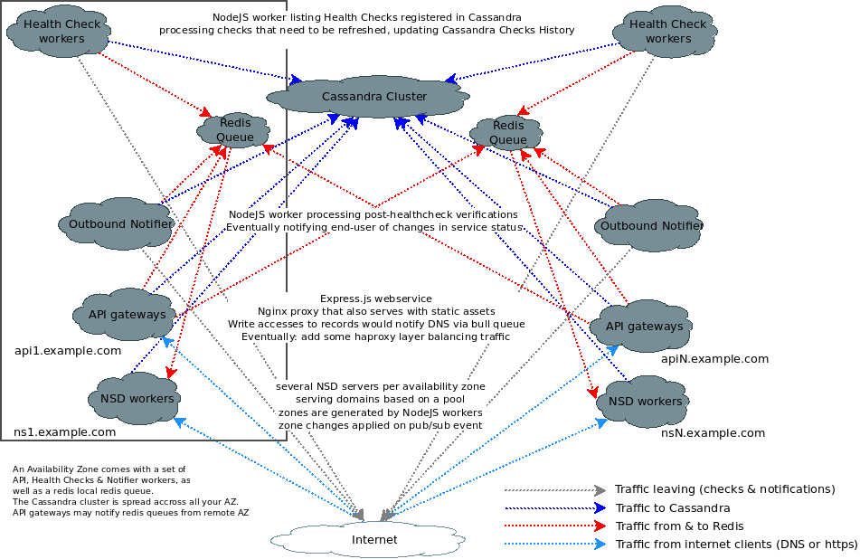
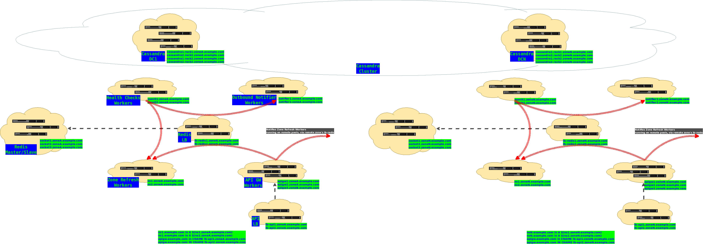

# HighWayToHell

Table of Contents
=================

  * [HighWayToHell](#highwaytohell)
    * [Introducing HWTH](#introducing-hwth)
      * [Pool](#pool)
      * [What does it do](#what-does-it-do)
      * [Scaling Out](#scaling-out)
      * [Todolist](#todolist)
    * [Databases](#databases)
    * [Introducing Workers](#introducing-workers)
      * [refreshZones](#refreshzones)
      * [checkHealth](#checkhealth)
      * [outboundNotifier](#outboundnotifier)
      * [apiGW](#apigw)
    * [Special Thanks](#special-thanks)

## Introducing HWTH

 * Some hopefully-scalable, DNSSEC-capable, DNS manager featuring health checks
   & alerts configuration (HTTP POST/GET, SMS or email).
 * See [QuickStart](QUICKSTART.md) for practical instructions building packages,
   deploying your setup, ...
 * See [our API doc](API.md) for a list of routes and some thoughts and notes.
 * Any advices, contribution or feedback welcome.

### Pool

### What does it do

 * starting the `refreshZones` worker, you would be able to generate NSD or
   BIND configurations & corresponding zones files. Note before doing so,
   you would have to start a `hwth-watchmark` service in charge of reloading
   your nameserver configuration - as root, while our NodeJS user can't.
 * starting the `checkHealth` worker, you would be able to run health checks
   that may eventually be used as conditions generating your DNS zones or
   scheduling notifications
 * starting the `apiGW` worker - and configuring some SSL-capable reverse
   proxy forwarding connections to your lookpack on port 8080, you would
   have access to a web client declaring domains, records, health checks,
   creating API tokens for CLI usage (see `samples.d/butters`), enabling
   2FA protection via authenticator such as Authy, sharing your zones
   management with other users.
 * starting the `outboundNotifier` worker, you should be able to configure
   POST/GET/email/SMS notifications based on your health check statuses,
   as well as notifications on login and/or failed login accessing our
   web service

### Scaling out

### Todolist

 * handling redis authentication
 * paging (?)
 * zones import tool?
 * unclear yet how we'll trust phone numbers as contacts ...
 * moar tests
 * api-less mode?
 * shinyness - CSS or frontend contributions most welcome
 * DNSSEC keys rotation open to discussion, bearing in mind it implies
   publishing new DS records to registrar, we can't automate it unilaterally
 * reproducible benchmarks & gnuplot magic ...

## Databases

Using a Redis backend - as a jobs queue, pub/sub, sessions storage,
2FA-establishing-token & 2FA-validated-token storage

Using a Cassandra backend storing pretty much everything else. The followings
tables would be used:

 * users: account-specific settings
 * twofa: a collection of 2fa secrets and mapped to their owner
 * tokens: a collection of tokens, mapped to their owner. TODO: a permissions
   string is defined, yet not used
 * contactaddresses: collection of contact addresses (only emails so far,
   could eventually include phone numbers) mapped to their owner
 * adding phone number as contact, shouldn't ask to check emails, rather sms
 * logins: a login history collection, associating an user ID to a client IP,
   a timestamp and wether login succeeded or failed
 * nspools: inventory of ns pools
 * zones: zones inventory and global settings, mapped to their nspool
 * rbaclookalike: maps users to zones to a role
 * records: DNS records definitions, mapped to their zone
 * checks: health checks definitions, mapped to their zone
 * checkhistory: health checks history, mapped to a check
 * notifications: a collection of conditions and target to notify, when service
   health changes, mapped to a check
 * dnsseckeys: storing base64-encoded ZSK & KSK keys, mapped to a ZSK & KSK
   key names, as listed in the zones table
 * signedzones: storing base64-encoded DNSSEC zones, once they're signed, for
   our neighbors to get their copy. mapped to a domain
 * config: a dummy table we would keep our schema verion into, so our database
   upgrade script can identify which patches to skip or apply.

## Introducing Workers

### refreshZones

A first class of worker is in charge of generating zones. `refreshZones`
connects to a couple of bull queue, and also opens a pair of
publisher/subscriber to redis.
Workers from a pool receive refresh notifications (from our API gateway or
health check workers) via the bull queues.
Upon completion, we send the corresponding domain name into our pubsub, so
that our neighbors eventually reload their own zones as well.

If a zone is subject to DNSSEC, then a signed copy is uploaded to Cassandra
when zone gets updated - and that copy gets installed to neighbors.

Note the `refreshZones` worker, running from an unprivileged user, would not be
able to reload your name servers. To address this, there is a second service you
would need to enable on any `refreshZones` worker that serves DNS zones. Said
process would run as root, using `inotifywait` to reload `nsd` or `bind`,
whenever a mark file gets updated in the process of refreshing zones. See
[QuickStart](QUICKSTART.md) for further details setting up your workers.

FIXME:

 * resolving NSs in charge for a zone, we have a
   `SELECT fqdn FROM nspools WHERE tag IN ('master', 'backup')`. It gives us the
   pair of nameserver FQDNs to include generating a zone. Now note that when
   your nspool tag name alphabetically succeeds your bkppool tag name, then
   `SELECT` would return nameserver FQDNs such as your bkppool would actually be
   considered to be your nspool, and vice versa.
 * ensure confQueue & zonesQueue are not applying some change simultaneously
   (some kind of lock ...)

DISCUSS:

 * do we need keeping plaintext zones when using DNSSEC?
 * we assume running name server on that worker, we could split it so a worker
   generates (& signs) zones (without necessarily running a name server
   locally), while an other one would only gets stuff we know passed checkzone
   (& got signed) then actually restarting their name server. Note: the
   generation/signature process does involve a checkzone that implies nsd or
   bind utils where installed, regardless of being name servers.

### checkHealth

A second class of worker is in charge of running health checks. `checkHealth`
setups a few schedules.
The first one iterates over the health checks declared in Cassandra, running
those that need to be refreshed and adding records to our health checks history
table.
A couple others purges older records from that history table, and checks that
might be referring to domains end-users would have purged.

### outboundNotifier

This class of worker would be listening for events from our other workers,
eventually sending HTTP POST, GET, SMS or email notifications.

The `checkHealth` worker may schedule notification settings to be checked for
matching configurations, having refreshed a check status.

The `apiGW` worker may schedule login history to be checked notifying user
his account was accessed.

### apiGW

Minimalist API gateway (we've proven it can be done ... I don't necessarily
enjoy customizing CSSs, be ensured I didn't test rendering on IExplorer ...),
with token authentication, 2FA-capable.

FIXME:

 * dont res.send.(errorcode) if req.sessions.userid: instead render a common
   template
 * error & confirmation pages back links & labels

## Special Thanks

 * First and foremost [PeerioTechnologies](https://www.peerio.com), my current employer
 * As well as [Clement Duhart](https://github.com/slash6475), for introducing me to NodeJS
 * [StackOverflow](https://stackoverflow.com), answering my most obscure questions
